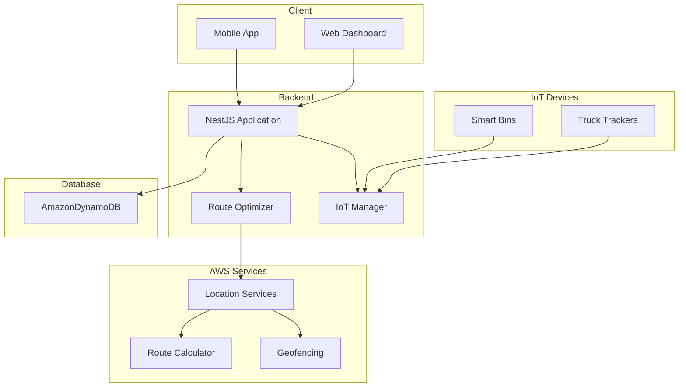
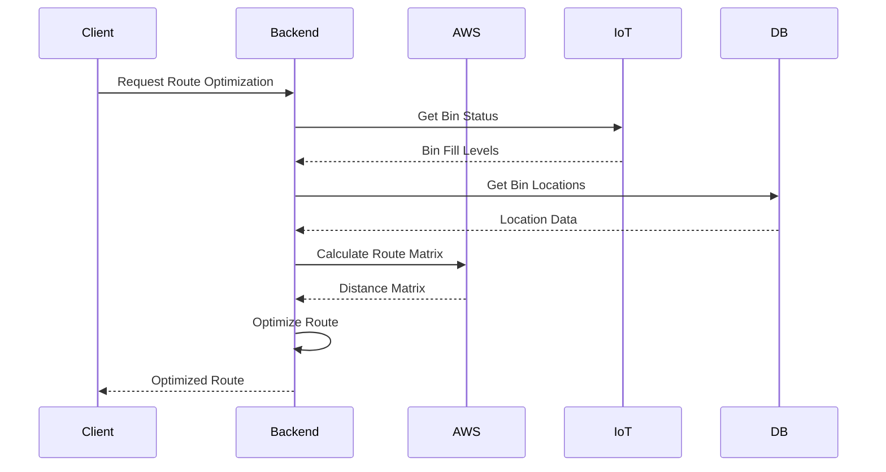

# AWS-Powered Smart Waste Management System

A comprehensive backend service that revolutionizes waste collection operations using AWS Location Services and IoT integration. This system optimizes waste collection routes in real-time, reducing operational costs and environmental impact.

## 🌟 Key Features

- **Real-time Route Optimization**: Advanced route optimization using AWS Location Services
- **IoT Integration**: Smart bin monitoring and real-time data collection
- **Cluster Management**: Efficient waste collection planning based on geographical clusters
- **Fleet Management**: Comprehensive truck fleet tracking and management
- **Incident Reporting**: Real-time incident tracking and reporting system
- **User Management**: Secure authentication and role-based access control
- **Admin Dashboard**: Comprehensive administrative controls and monitoring

## 🗺️ Route Optimization System

The route optimization system is the core feature of this project, leveraging AWS Location Services to provide efficient waste collection routes.

### Key Components

- **AWS Location Services Integration**
  - Real-time route calculation using `TruckRouteCalculator`
  - Distance matrix computation for multiple locations
  - Optimized for vehicle routing

- **Smart Route Planning**
  - Dynamic route optimization based on bin fill levels
  - Real-time traffic consideration
  - Multi-stop optimization
  - Chunk-based processing for large-scale operations

- **Performance Features**
  - Efficient handling of multiple collection points
  - Real-time route updates
  - Distance and time optimization
  - Cluster-based route planning

### How It Works

1. **Data Collection**
   - Gathers real-time bin locations
   - Collects truck fleet positions
   - Monitors bin fill levels

2. **Route Calculation**
   - Uses AWS Location Services for accurate distance calculation
   - Implements greedy algorithm for route optimization
   - Considers multiple constraints (time, capacity, priority)

3. **Optimization Process**
   - Divides large areas into manageable clusters
   - Calculates optimal routes within clusters
   - Combines cluster routes for complete collection plan

4. **Real-time Updates**
   - Continuous route optimization
   - Dynamic rerouting based on new data
   - Incident-based route adjustments

## ☁️ AWS Services Integration

This project heavily utilizes AWS services to provide robust and scalable functionality.

### AWS Location Services

- **Route Calculator**
  - Custom `TruckRouteCalculator` for waste collection vehicles
  - Real-time distance and time calculations
  - Optimized for multiple stops and vehicle constraints

- **Geofencing**
  - Bin location tracking
  - Cluster boundary management
  - Service area optimization

### Configuration

```typescript
// AWS Location Service Configuration
const locationClient = new LocationClient({
  region: process.env.AWS_REGION,
  credentials: {
    accessKeyId: process.env.AWS_ACCESS_KEY_ID,
    secretAccessKey: process.env.AWS_SECRET_ACCESS_KEY
  }
});
```

### Environment Variables

```env
AWS_REGION=your-region
AWS_ACCESS_KEY_ID=your-access-key
AWS_SECRET_ACCESS_KEY=your-secret-key
ROUTE_CALCULATOR_NAME=TruckRouteCalculator
```

### Security Best Practices

- IAM roles and policies for service access
- Environment variable management
- Secure credential handling
- API key rotation

## 📐 Architecture Diagram

### System Architecture



### Route Optimization Flow



## 🛠 Tech Stack

- **Framework**: NestJS
- **Language**: TypeScript
- **Cloud Services**: AWS Location Services
- **Security**: Helmet, CORS
- **API**: RESTful with versioning support

## 🚀 Getting Started

### Prerequisites

- Node.js (v14 or higher)
- AWS Account with Location Services enabled
- Amazon DynamoDB (for data storage)

### Installation

1. Clone the repository
```bash
git clone https://github.com/emrebaranarca/aws-waste-route-optimizer.git
```

2. Install dependencies
```bash
npm install
```

3. Start the application
```bash
npm run start:dev
```

